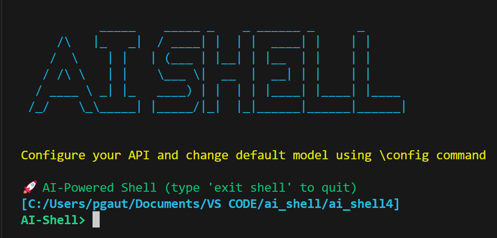

# AI Shell

AI Shell is a powerful command-line tool that converts natural language into CLI commands. It uses a hybrid approach with both local LLM (TinyLlama) and cloud-based AI services to generate accurate commands for your operating system.



## Features

- Convert natural language to CLI commands
- Support for Windows, Linux, and macOS
- Local LLM for offline operation
- Cloud API integration (Claude, OpenAI, DeepSeek)
- Command caching for faster responses
- SSH remote execution support
- Auto-correction for typos

## Platform Support

AI Shell works on:
- Windows
- macOS
- Linux distributions

## Installation

### Easy Installation

After cloning the repository, use the platform-specific installer:

**Windows:**
```
cd AI_Shell
install.bat
```

**Linux/macOS:**
```
cd AI_Shell
chmod +x install.sh
./install.sh
```

### Alternative Installation (using npm)

If you have Node.js installed:

```bash
# Navigate to the project directory
cd AI_Shell

# Install the application globally
npm install -g .
```

### Manual Installation

If the above methods don't work:

1. Make sure Python is installed
2. Install dependencies: `python -m pip install -r requirements.txt`
3. Run directly: `python ai_shell.py`

## Usage

Once installed, you can run AI Shell from anywhere by typing:

```bash
ai-shell
```

Type `exit` to quit the shell.

1. Type your request in natural language:
   ```
   AI-Shell> show all docker containers
   ```

2. AI Shell will generate the appropriate command:
   ```
   Command: docker ps -a
   ```

3. Choose an option:
   - `y` to execute the command
   - `n` to skip execution
   - `r` to regenerate with a different AI model

## Special Commands

- `\help` - Show help guide
- `\config` - Configure API keys and model settings
- `exit shell` - Exit the application

## Configuration

Use the `\config` command to:
- Set API provider (Claude, OpenAI, DeepSeek, or offline mode)
- Configure API keys
- Download or update the local LLM model
- Download link for tiny llama: https://huggingface.co/TheBloke/TinyLlama-1.1B-Chat-v1.0-GGUF/resolve/main/tinyllama-1.1b-chat-v1.0.Q5_K_M.gguf?download=true

## Uninstallation

To uninstall AI Shell:

```bash
# Option 1: If installed globally via npm
npm uninstall -g aishell
npm uninstall -g ai-shell

# Option 2: From the source directory
cd AI_Shell
node uninstall.js
```

### Complete Removal (if command still persists)

If the `ai-shell` command is still available after uninstallation:

**Windows:**
```bash
# Check where the command is located
where ai-shell

# Check for Python entry points
pip uninstall aishell ai-shell -y

# Check for scripts in Python path
python -m pip uninstall aishell ai-shell -y

# Remove from Environment Variables
del /f %APPDATA%\npm\ai-shell.bat
```

**Linux/macOS:**
```bash
# Check where the command is located
which ai-shell

# Remove from common locations
sudo rm -f /usr/local/bin/ai-shell /usr/bin/ai-shell

# Check for Python entry points
pip uninstall aishell ai-shell -y
```

**Additional Steps:**
1. Check your PATH environment variable for any AI Shell directories
2. Look for remaining files in:
   - `%APPDATA%\npm\` (Windows)
   - `~/.npm/` (Linux/macOS)
   - Python site-packages directories
3. Restart your terminal completely after uninstallation


## Troubleshooting

### Command Name Conflict
If you see `ModuleNotFoundError: No module named 'aishell'`:
- Use `ai-shell` (with hyphen) instead of `aishell`
- Run the `fix-conflict.bat` script to remove conflicting packages


### Command Not Found
If you see "Command not found" errors after installation:
- Make sure your terminal was restarted after installation
- Run the command using the full path: `C:\path\to\AI_Shell\bin\ai-shell`
- Try running the Python script directly: `python ai_shell.py`

### Python Not Found
If you see "Python not found" errors:
- Ensure Python is installed (try `py --version` or `python --version` in your terminal)
- On Windows, make sure you checked "Add Python to PATH" during installation
- You can manually run the application with `py ai_shell.py` or `python ai_shell.py`

### PATH Issues
If adding to PATH doesn't work:
1. Open System Properties -> Advanced -> Environment Variables
2. Edit the PATH variable and manually add the full path to your AI Shell bin directory

## License

This project is licensed under the MIT License - see the LICENSE file for details.
